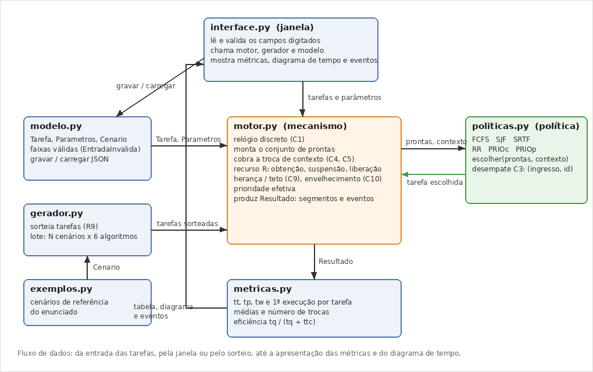

Este documento descreve como o simulador funciona por dentro: a separação entre política e mecanismo, o que acontece a cada unidade de tempo, a estrutura de uma tarefa, os parâmetros configuráveis e as convenções de simulação que determinam os números produzidos. É o texto para quem vai ler, modificar ou estender o código. A operação do programa está nos tutoriais.

## 1. Visão geral

O simulador reproduz, em tempo discreto, o escalonamento de um conjunto de tarefas em um único processador. Cada tarefa é descrita por instante de ingresso, tempo de processamento e prioridade e pode declarar uma seção crítica sobre um recurso de uso exclusivo R. O programa implementa seis algoritmos de escalonamento (FCFS, SJF, SRTF, Round-Robin, prioridade cooperativa e prioridade preemptiva), cobra o custo da troca de contexto, reproduz a inversão de prioridades e os dois protocolos de correção, herança e teto, e aplica envelhecimento à prioridade das tarefas prontas. Para cada simulação produz as métricas por tarefa e em média, a sequência de execução, o diagrama de tempo e a lista de eventos. Um gerador de cenários sorteia conjuntos de tarefas e compara os seis algoritmos sobre um lote.

O modelo é o das aulas 5 e 6: um processador, tarefas independentes exceto pela disputa por R, tempo em unidades inteiras e nenhuma operação de entrada e saída além da seção crítica.

## 2. Separação entre política e mecanismo

O eixo do projeto é a divisão do escalonador em duas partes que não se conhecem.

O **mecanismo** está em `simulador/motor.py`, na classe `Motor`. Ele avança o relógio, sabe quais tarefas já ingressaram, quais concluíram e quais estão suspensas à espera de R, cobra a troca de contexto, controla a fatia do Round-Robin, administra o recurso e recalcula a prioridade efetiva sob herança, teto e envelhecimento. Esse código é único: os seis algoritmos passam pelo mesmo laço.

A **política** está em `simulador/politicas.py`. Cada algoritmo é uma classe pequena com um único método relevante, `escolher(prontas, contexto)`, que recebe o conjunto de tarefas prontas montado pelo motor e devolve a tarefa que deve receber o processador. A política não conhece o relógio, não sabe quanto custa uma troca de contexto e não sabe que R existe. Tudo o que ela enxerga além do conjunto de prontas é o método `contexto.prioridade_efetiva(tarefa)`, pelo qual as políticas de prioridade obtêm um valor já corrigido por herança, teto e envelhecimento, sem saber como ele foi calculado.

A fronteira entre os dois lados é o método `Motor._decidir()`. Ele determina *quando* a política é consultada, o que depende de três atributos declarados por cada política:

| Atributo | Significado | Quem liga |
|---|---|---|
| `preemptiva` | a escolha é reavaliada a cada unidade de tempo | SRTF, PRIOp |
| `usa_quantum` | a tarefa perde o processador ao esgotar a fatia | RR |
| `usa_prioridade` | a escolha depende da prioridade efetiva | PRIOc, PRIOp |

Com essa divisão, cada algoritmo cabe em poucas linhas. FCFS, SJF, SRTF, PRIOc e PRIOp são um `min()` sobre o conjunto de prontas com uma chave de ordenação diferente; PRIOp é PRIOc com `preemptiva = True`. Só o Round-Robin guarda estado, a fila circular, porque a ordem de chegada ao conjunto de prontas não é recuperável a partir dos dados das tarefas.

```python
class SRTF(Politica):
    preemptiva = True
    def escolher(self, prontas, contexto):
        return min(prontas, key=lambda t: (t.restante,) + _desempate(t))

class PrioridadePreemptiva(PrioridadeCooperativa):
    preemptiva = True
```

Toda chave de ordenação termina com `_desempate(t) = (t.ingresso, t.id)`, que implementa a convenção C3 em um único lugar.

## 3. Diagrama de módulos



O fluxo é o seguinte. A janela (`interface.py`) lê os campos digitados, ou pede ao gerador (`gerador.py`) um conjunto sorteado, e monta objetos `Tarefa` e `Parametros` (`modelo.py`). Esses objetos entram no motor (`motor.py`), que a cada decisão consulta a política (`politicas.py`) e ao final devolve um `Resultado` com o estado final das tarefas, os segmentos do diagrama de tempo e os eventos. As métricas (`metricas.py`) são calculadas a partir do `Resultado` e apresentadas pela janela na tabela, no diagrama e na aba de eventos. Gravar e carregar um cenário passa pela serialização em JSON de `modelo.py`; os cenários de referência do enunciado ficam em `exemplos.py`.

| Arquivo | Conteúdo |
|---|---|
| `main.py` | ponto de entrada; abre a janela |
| `Simulador.pyw` | mesmo ponto de entrada, sem console, para duplo clique com Python instalado |
| `simulador/modelo.py` | `Tarefa`, `Parametros`, `Cenario`, validação das faixas, JSON |
| `simulador/politicas.py` | os seis algoritmos |
| `simulador/motor.py` | laço de simulação, recurso R, herança, teto, envelhecimento, `Resultado` |
| `simulador/metricas.py` | `Metricas`, eficiência |
| `simulador/gerador.py` | `FaixasSorteio`, `sortear_tarefas`, `comparar_em_lote` |
| `simulador/exemplos.py` | cenários de referência |
| `simulador/interface.py` | janela tkinter |
| `testes/test_referencia.py` | reprodução automática dos cenários de validação do enunciado |

## 4. Estrutura de uma tarefa

A classe `Tarefa` (`modelo.py`) tem duas partes: os dados de entrada, que descrevem a tarefa, e o estado de execução, que o motor preenche durante a simulação e que começa zerado a cada nova simulação (o motor trabalha sobre cópias).

Dados de entrada:

| Campo | Tipo | Função |
|---|---|---|
| `id` | inteiro ≥ 1 | identificador; aparece como `t1`, `t2`, ... |
| `ingresso` | inteiro ≥ 0 | instante em que a tarefa surge |
| `tp` | inteiro ≥ 1 | tempo de processamento demandado |
| `prioridade` | inteiro ≥ 0 | prioridade base; valor maior, prioridade mais alta |
| `uso_de_r` | tupla `(inicio, duracao)` ou `None` | seção crítica: obtém R após executar `inicio` unidades e o mantém até ter executado `inicio + duracao`; precisa caber em `tp` |

Estado de execução:

| Campo | Tipo | Função |
|---|---|---|
| `executado` | inteiro | unidades úteis já executadas; `restante = tp − executado` |
| `conclusao` | inteiro ou `None` | instante de conclusão |
| `primeiro_despacho` | inteiro ou `None` | instante em que recebeu o processador pela primeira vez |
| `ultimo_despacho` | inteiro ou `None` | instante do último despacho; referência do envelhecimento |
| `prioridade_elevada` | inteiro ou `None` | valor herdado ou teto em vigor; `None` fora da elevação |
| `detem_r` | booleano | a tarefa mantém R |
| `bloqueada` | booleano | a tarefa está suspensa à espera de R e fora do conjunto de prontas |

A construção de uma `Tarefa` valida as faixas e levanta `EntradaInvalida` com uma mensagem descritiva quando algum valor está fora delas. A mesma exceção é usada por `Parametros.validar()` e pela interface, de modo que toda recusa de entrada chega à janela pelo mesmo caminho.

## 5. Interface dos módulos

### `modelo.py`

| Nome | Recebe | Devolve | Faz |
|---|---|---|---|
| `Tarefa(id, ingresso, tp, prioridade, uso_de_r=None)` | os dados de entrada | instância | valida as faixas |
| `Tarefa.copia()` | — | nova `Tarefa` | cópia só dos dados de entrada, com estado zerado |
| `Parametros(algoritmo, quantum, custo_troca, protocolo, envelhecimento)` | os parâmetros | instância | agrupa os parâmetros do escalonador |
| `Parametros.validar()` | — | a própria instância | recusa quantum ≤ custo sob RR, valores negativos e nomes desconhecidos |
| `Cenario(tarefas, parametros, nome)` | lista de tarefas e parâmetros | instância | unidade de gravação |
| `Cenario.gravar(caminho)` / `Cenario.carregar(caminho)` | caminho de arquivo | — / `Cenario` | serialização em JSON com validação na leitura |

### `politicas.py`

| Nome | Recebe | Devolve | Faz |
|---|---|---|---|
| `Politica.escolher(prontas, contexto)` | lista de tarefas prontas, objeto com `prioridade_efetiva()` | uma das tarefas | a decisão do algoritmo |
| `Politica.quantum_esgotado(tarefa)` | a tarefa que esgotou a fatia | — | só o RR reage: reposiciona a tarefa na cauda na próxima escolha |
| `Politica.reiniciar()` | — | — | limpa estado interno (a fila do RR) |
| `criar_politica(sigla)` | `"FCFS"`, `"SJF"`, `"SRTF"`, `"RR"`, `"PRIOc"` ou `"PRIOp"` | instância da política | fábrica usada pelo motor |

### `motor.py`

| Nome | Recebe | Devolve | Faz |
|---|---|---|---|
| `Motor(tarefas, parametros)` | tarefas e parâmetros validados | instância | prepara cópias das tarefas, a política e o teto de R |
| `Motor.executar()` | — | `Resultado` | roda o laço até todas as tarefas concluírem |
| `Motor.prioridade_efetiva(tarefa)` | uma tarefa | inteiro | base + envelhecimento, elevada por herança ou teto |
| `simular(tarefas, parametros)` | idem | `Resultado` | atalho: cria o motor e executa |
| `Resultado.tarefas` | — | lista de `Tarefa` | estado final de cada tarefa |
| `Resultado.segmentos` | — | lista de `Segmento` | intervalos `[inicio, fim)` de tipo `execucao`, `troca`, `bloqueio` ou `recurso` |
| `Resultado.eventos` | — | lista de `(instante, texto)` | o que aconteceu em cada instante |
| `Resultado.trocas` | — | inteiro | número de trocas de contexto |
| `Resultado.bloqueio_direto`, `Resultado.inversao` | — | dicionário `id → unidades` | classificação da espera de cada tarefa suspensa |
| `Resultado.sequencia()` | — | texto | `t1[0,2) t4[2,3) ...` |

### `metricas.py`

| Nome | Recebe | Devolve | Faz |
|---|---|---|---|
| `Metricas(resultado)` | um `Resultado` | instância com `por_tarefa`, `tt_medio`, `tw_medio`, `tp_medio`, `primeira_execucao_media`, `trocas`, `eficiencia` | calcula tudo o que a tabela mostra |
| `eficiencia(parametros)` | `Parametros` | `tq / (tq + ttc)` ou `None` | `None` nos algoritmos sem quantum |

### `gerador.py`

| Nome | Recebe | Devolve | Faz |
|---|---|---|---|
| `FaixasSorteio(quantidade, ingresso_max, tp_max, prioridade_max, com_recurso)` | limites | instância | parâmetros do sorteio |
| `sortear_tarefas(faixas)` | `FaixasSorteio` | lista de `Tarefa` | um conjunto aleatório |
| `comparar_em_lote(faixas, amostras, parametros_base)` | faixas, número de cenários, quantum/custo/protocolo/alfa | lista de `MediaAlgoritmo` | médias de `tt`, `tw` e primeira execução por algoritmo |

### `interface.py`

`Aplicacao` é a janela (`tk.Tk`). Os métodos públicos correspondem aos botões: `aplicar_quantidade`, `sortear`, `simular`, `comparar_lote`, `gravar`, `carregar` e `carregar_cenario(cenario)`. A leitura dos campos é feita por `ler_tarefas()`, `ler_parametros()` e `ler_faixas()`, que levantam `EntradaInvalida` e posicionam o foco no campo errado; `simular()` e os demais capturam a exceção e mostram a mensagem. Exceções não previstas são redirecionadas por `report_callback_exception` para uma janela de erro, de modo que o programa nunca fecha sozinho.

## 6. Parâmetros configuráveis

| Parâmetro | Onde | Faixa válida | Padrão | Observações |
|---|---|---|---|---|
| Número de tarefas | tabela | 1 a 30 | 5 | linhas da tabela |
| Algoritmo | `Parametros.algoritmo` | FCFS, SJF, SRTF, RR, PRIOc, PRIOp | FCFS | |
| Quantum `tq` | `Parametros.quantum` | inteiro ≥ 1 e maior que `ttc` | 2 | só usado pelo RR; no lote é obrigatório porque o RR faz parte da comparação |
| Custo da troca `ttc` | `Parametros.custo_troca` | inteiro ≥ 0 | 0 | vale para todos os algoritmos |
| Protocolo para R | `Parametros.protocolo` | `nenhum`, `heranca`, `teto` | `nenhum` | herança e teto não se combinam |
| Envelhecimento α | `Parametros.envelhecimento` | inteiro ≥ 0 | 0 | 0 desliga; só influencia PRIOc e PRIOp |
| Ingresso máximo | `FaixasSorteio.ingresso_max` | inteiro ≥ 0 | 8 | sorteio uniforme em `[0, máximo]` |
| `tp` máximo | `FaixasSorteio.tp_max` | inteiro ≥ 1 | 6 | sorteio uniforme em `[1, máximo]` |
| Prioridade máxima | `FaixasSorteio.prioridade_max` | inteiro ≥ 1 | 5 | sorteio uniforme em `[1, máximo]` |
| Cenários no lote | `comparar_em_lote(amostras)` | 1 a 100 000 | 50 | |
| Sortear seções críticas | `FaixasSorteio.com_recurso` | ligado ou desligado | desligado | cerca de 40 % das tarefas recebem uma seção crítica aleatória contida em `tp` |

Os valores padrão do sorteio são os da seção 4.7 do enunciado, de modo que a comparação em lote com os valores iniciais reproduz aquele experimento.

## 7. Funcionamento interno

O laço de `Motor.executar()` repete os passos abaixo enquanto houver tarefa não concluída. O instante corrente é `t`; `atual` é a tarefa que ocupa o processador (ou nenhuma) e `ultima` é a última que o ocupou, usada para decidir se há troca de contexto.

**Pedidos de recurso.** Toda tarefa que já ingressou, não concluiu, declara seção crítica e está exatamente no seu início (`executado == inicio`) pede R. Se R está livre ou é dela, nada muda. Se R pertence a outra tarefa, ela é marcada como `bloqueada`: sai do conjunto de prontas e, se era a tarefa atual, libera o processador. A verificação ocorre no começo de cada unidade de tempo, antes de qualquer decisão, de modo que uma tarefa nunca é despachada para em seguida descobrir que R está ocupado.

**Herança.** Se o protocolo é herança, R tem detentora e existe alguma tarefa bloqueada, a detentora assume como `prioridade_elevada` a maior prioridade base entre as bloqueadas, caso seja maior que a sua. O valor é recalculado a cada unidade de tempo, para que uma nova suspensa de prioridade ainda maior também seja herdada.

**Conjunto de prontas.** É a lista das tarefas com `ingresso ≤ t`, não concluídas e não bloqueadas, na ordem `(ingresso, id)`. Se estiver vazio, o relógio salta para o menor ingresso futuro e o processador fica ocioso nesse intervalo; a tarefa despachada depois do salto conta como uma troca de contexto em relação à anterior.

**Decisão.** A política é consultada em três situações: o processador está livre (`atual` é `None`); a política é preemptiva; ou a política usa quantum e a fatia se esgotou. Fora delas, a tarefa atual continua. Ao consultar a política após o esgotamento da fatia, o motor antes avisa a política com `quantum_esgotado(atual)`, o que no Round-Robin manda a tarefa para a cauda da fila depois das recém-chegadas (C6).

**Despacho e troca de contexto.** Se a tarefa escolhida é diferente de `ultima`, há troca de contexto: o contador de trocas é incrementado, a fatia é reiniciada em `tq` e as próximas `ttc` unidades de tempo são consumidas pela troca. Cada unidade de troca desconta uma unidade da fatia (C5) e gera um segmento do tipo `troca` no diagrama. Se a escolhida é a mesma `ultima` (por exemplo, a única tarefa pronta recebendo uma nova fatia, ou uma tarefa que retorna de suspensão sem que outra tenha executado), não há troca nem custo. A troca e a primeira unidade útil que a segue são indivisíveis: o motor não consulta a política durante a troca, para que todo custo pago produza ao menos uma unidade de trabalho. O instante do despacho, incluindo a troca, é o que define `primeiro_despacho`, e portanto a métrica de primeira execução.

**Unidade útil.** A tarefa atual executa uma unidade: se está no início da seção crítica, obtém R antes de executar (sob teto, `prioridade_elevada` recebe o teto do recurso nesse momento); `executado` cresce, a fatia decresce, `t` avança. Ao atingir o fim da seção crítica, R é liberado, `prioridade_elevada` volta a `None` e todas as tarefas bloqueadas voltam ao conjunto de prontas no mesmo instante. Ao atingir `tp`, a tarefa conclui e o processador fica livre.

**Prioridade efetiva.** Para a política, `prioridade_efetiva(tarefa)` é:

```
base = prioridade
se alfa > 0 e a tarefa não está executando:
    base += alfa * (t − referência)      # referência = último despacho, ou ingresso se nunca executou
resultado = max(base, prioridade_elevada) se houver elevação, senão base
```

A tarefa em execução não envelhece: sua prioridade efetiva é a base (ou a elevada, se mantém R sob herança ou teto). Ao ser despachada, `ultimo_despacho` recebe `t`, o que zera o envelhecimento acumulado (C10).

**Classificação da espera.** A cada unidade de tempo, para cada tarefa bloqueada, o motor registra um segmento `bloqueio` e soma uma unidade em `bloqueio_direto` se o processador está com a detentora de R, ou em `inversao` caso contrário. É essa contagem que a interface mostra como "bloqueio direto" e "inversão de prioridades": a primeira é inevitável e limitada pela seção crítica; a segunda é causada por tarefas intermediárias que sequer usam R.

O motor acumula os intervalos no `Resultado` em quatro tipos de segmento, que o diagrama desenha de forma diferente: `execucao` (barra colorida), `troca` (barra cinza), `bloqueio` (faixa vermelha hachurada) e `recurso` (traço acima da linha, do instante em que R é obtido ao instante em que é liberado).

## 8. Convenções de simulação

Estas decisões determinam os números produzidos. Divergir de qualquer uma delas gera resultados diferentes para o mesmo conjunto de tarefas. As dez primeiras são as do enunciado; as demais completam casos que o enunciado deixa em aberto.

1. **Unidade de tempo.** O tempo é discreto e avança de uma em uma unidade. Ingressos, durações, quantum e custo de troca são inteiros. Nos cenários das aulas a unidade é o segundo (C1).
2. **Escala de prioridade.** Valor maior significa prioridade mais alta (C2).
3. **Desempate.** Entre tarefas equivalentes para a política, vence a de menor instante de ingresso e, persistindo o empate, a de menor identificador (C3). Isso vale também entre a tarefa em execução e uma recém-chegada nas políticas preemptivas: uma tarefa só é preemptada por outra estritamente melhor ou, em empate, por uma que ingressou antes.
4. **Quando há troca de contexto.** Sempre que a tarefa despachada é diferente da última que ocupou o processador, inclusive no primeiro despacho e após um período ocioso (C4). Reentregar o processador à mesma tarefa, por exemplo uma nova fatia para a única tarefa pronta ou o retorno de uma suspensão sem que outra tenha executado, não é troca.
5. **Custo da troca.** O custo é descontado da fatia concedida, nunca somado a ela. Sob Round-Robin com troca, a tarefa executa `tq − ttc` unidades úteis (C5). Nos demais algoritmos a troca ocupa `ttc` unidades do processador antes de a tarefa executar, atrasando tudo o que vem depois. Durante a troca a política não é consultada.
6. **Posição na fila após o quantum.** A tarefa que esgota o quantum volta à cauda da fila depois das que ingressaram naquele mesmo instante (C6). Uma tarefa que sai da fila por conclusão ou suspensão e volta depois entra na cauda no momento em que volta.
7. **Referência da seção crítica.** A seção crítica é medida no tempo de execução própria da tarefa: início 1 e duração 4 significam que a tarefa obtém R após executar 1 unidade útil e o mantém até ter executado 5 (C7). Unidades gastas em troca de contexto não contam.
8. **Tempo de espera.** `tw = tt − tp`, englobando fila, suspensão à espera de R e trocas de contexto (C8).
9. **Teto e exclusividade dos protocolos.** O teto de R é a maior prioridade base entre as tarefas que declaram seção crítica, calculado antes da simulação, ainda que a disputa não ocorra. Herança e teto são alternativos e não se combinam (C9).
10. **Envelhecimento.** A prioridade efetiva de uma tarefa pronta cresce α por unidade de tempo desde o último despacho, ou desde o ingresso se ela nunca executou, e volta ao valor base ao receber o processador (C10). A tarefa em execução não envelhece.
11. **Relógio ocioso.** Se nenhuma tarefa está pronta, o relógio salta para o próximo ingresso. O intervalo ocioso não aparece como espera de ninguém.
12. **Momento do pedido de R.** O pedido é verificado no início de cada unidade de tempo, antes da decisão. Uma tarefa que chega ao início da seção crítica com R ocupado é suspensa sem consumir tempo de processador; a decisão daquela unidade já não a considera.
13. **Momento da liberação de R.** R é liberado ao fim da unidade em que a tarefa completa a seção crítica, e as suspensas voltam a prontas no mesmo instante, a tempo da decisão seguinte. Sob PRIOp, uma tarefa de prioridade mais alta que acorda preempta imediatamente.
14. **Elevação de prioridade.** Sob herança, a detentora assume a maior prioridade base entre as suspensas a partir do instante em que a primeira delas é suspensa, e volta à base ao liberar R. Sob teto, assume o teto no instante em que obtém R e volta à base ao liberar. A elevação se compõe com o envelhecimento por `max(base + envelhecimento, elevada)`.
15. **Primeira execução.** É o instante do primeiro despacho, contando a troca de contexto, menos o ingresso. Com `ttc = 0` coincide com o início da primeira unidade útil.
16. **Preempção e quantum no Round-Robin.** A fatia começa no despacho, incluindo a troca; ao terminar a fatia com trabalho restante, a tarefa volta à fila. Se a tarefa conclui ou se suspende antes, a fatia termina ali.
17. **Sorteio.** Os valores são sorteados uniformemente nas faixas fechadas indicadas na seção 6, sem semente fixa. Duas execuções nunca produzem o mesmo lote.

Os quatro cenários de validação do enunciado (Aula 5 com e sem custo de troca, inversão de prioridades com herança e teto, teto sem disputa e inanição com envelhecimento) estão codificados em `testes/test_referencia.py` e reproduzidos exatamente sob estas convenções. Executar `python -m unittest discover -s testes -v` na raiz do repositório confere todos de uma vez.

## 9. Dependências e ambiente

- **Linguagem:** Python 3.10 ou superior. O código usa `dataclasses`, anotações `int | None` e f-strings, e nada além da biblioteca padrão.
- **Bibliotecas:** apenas módulos padrão: `tkinter` e `tkinter.ttk` para a janela, `json` para os cenários, `random` para o sorteio, `dataclasses`, `os`, `sys` e `traceback`. Não há arquivo de requisitos porque não há nada a instalar.
- **Executável:** `Simulador.exe` é gerado com o PyInstaller (`pyinstaller --onefile --windowed --name Simulador main.py`) em Windows, Python 3.12. O arquivo `.github/workflows/gerar_executavel.yml` executa esse comando no GitHub Actions a cada envio ao repositório, roda os testes de referência antes e grava o executável resultante na raiz; `gerar_executavel.bat` faz o mesmo em uma máquina Windows local. O executável carrega uma cópia do interpretador e do Tk, por isso o tamanho de algumas dezenas de megabytes e a demora de alguns segundos na primeira abertura.
- **Cenários:** a pasta `cenarios/` contém os cenários de referência em JSON, gerados a partir de `simulador/exemplos.py`. O executável procura essa pasta ao lado de si ao gravar e carregar; se ela não existir, usa a própria pasta do programa.
- **Testes:** `python -m unittest discover -s testes -v`, a partir da raiz.
