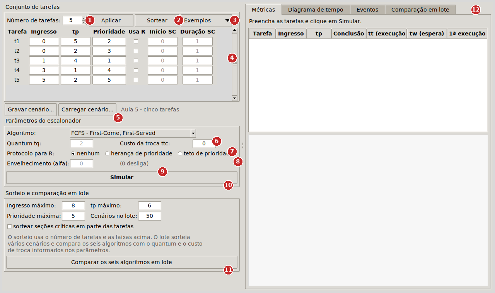
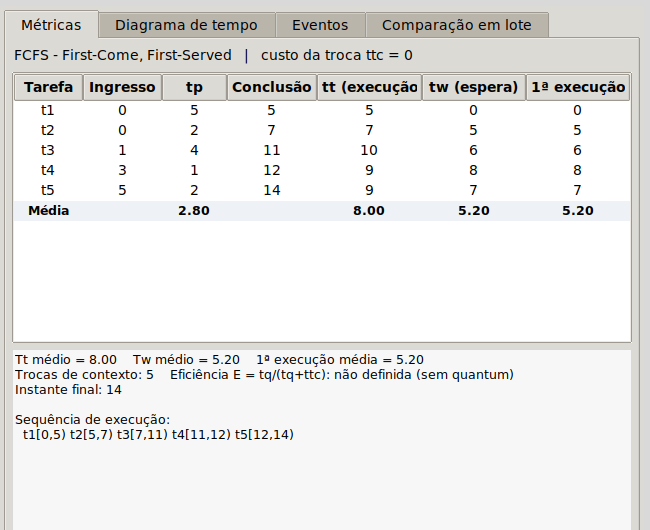
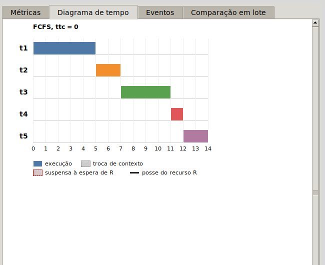

Este tutorial mostra como colocar o simulador para funcionar e como confirmar, em menos de um minuto, que ele está produzindo resultados. Não explica conceitos nem justifica decisões: para isso há a documentação técnica em `docs/documentacao_projeto.pdf`.

## 1. Pré-requisitos

| Forma de execução | O que é preciso |
|---|---|
| `Simulador.exe` (recomendada) | Windows 10 ou 11, 64 bits. Nada precisa ser instalado. |
| `Simulador.pyw` ou `main.py` | Python 3.10 ou superior com o módulo `tkinter`, que acompanha o instalador oficial do Python para Windows e macOS. Nas distribuições Linux, o pacote costuma se chamar `python3-tk`. Nenhuma biblioteca externa é usada. |

O programa não recebe argumentos de linha de comando e não precisa de nenhuma pasta especial: basta que os arquivos fiquem juntos, como vieram no repositório.

## 2. Abertura

1. Descompacte o arquivo baixado do GitHub (`Code → Download ZIP`) em uma pasta nova.
2. Abra a pasta `simulador-escalonamento`. O conteúdo é o da figura 1.
3. Dê dois cliques em **`Simulador.exe`**.

Na primeira abertura, o Windows pode exibir o aviso "O Windows protegeu o computador", porque o executável não é assinado digitalmente. Clique em **Mais informações** e depois em **Executar assim mesmo**. O aviso não volta a aparecer.

Se o computador tiver Python instalado, dois cliques em `Simulador.pyw` abrem a mesma janela sem passar pelo executável.

## 3. Primeira tela

A janela abre já preenchida com o conjunto de cinco tarefas da Aula 5, para que o primeiro resultado possa ser obtido sem digitar nada. A figura 2 identifica cada região.

| Nº | Elemento | Para que serve |
|---|---|---|
| 1 | **Número de tarefas** e botão **Aplicar** | Define quantas linhas a tabela de tarefas terá. |
| 2 | Botão **Sortear** | Preenche a tabela com um conjunto aleatório de tarefas. |
| 3 | Botão **Exemplos** | Carrega um dos cenários de referência do enunciado. |
| 4 | Tabela de tarefas | Uma linha por tarefa: ingresso, tempo de processamento `tp`, prioridade e, se marcado **Usa R**, o início e a duração da seção crítica. |
| 5 | **Gravar cenário...** e **Carregar cenário...** | Salvam e recuperam o conjunto de tarefas e os parâmetros em um arquivo `.json`. Ao lado aparece o nome do cenário carregado. |
| 6 | **Algoritmo** | Escolha entre FCFS, SJF, SRTF, RR, PRIOc e PRIOp. |
| 7 | **Quantum tq** e **Custo da troca ttc** | Parâmetros de tempo do escalonador. O quantum só fica habilitado sob Round-Robin. |
| 8 | **Protocolo para R** | Nenhum, herança de prioridade ou teto de prioridade. |
| 9 | **Envelhecimento (alfa)** | Passo do envelhecimento; 0 desliga. Habilitado só nos algoritmos de prioridade. |
| 10 | Botão **Simular** | Executa a simulação com os dados da tabela e os parâmetros. |
| 11 | **Sorteio e comparação em lote** | Faixas usadas pelo sorteio e botão que compara os seis algoritmos sobre vários cenários sorteados. |
| 12 | Abas de resultado | **Métricas**, **Diagrama de tempo**, **Eventos** e **Comparação em lote**. |

## 4. Execução mínima

1. Sem alterar nada, clique em **Simular** (região 10).

É a sequência mais curta que produz um resultado: a aba **Métricas** passa a exibir a tabela por tarefa, a linha de média e o resumo da simulação.

## 5. Resultado esperado

Ao final do passo anterior a tela deve ser a da figura 3. Os valores a conferir são os da linha **Média**: `tt = 8,00`, `tw = 5,20` e `1ª execução = 5,20`, com **5 trocas de contexto**. São exatamente os valores do FCFS na tabela da Aula 5.

Clique na aba **Diagrama de tempo** para ver a mesma execução em forma de gráfico, uma linha por tarefa (figura 4).

Se esses números apareceram, o programa está funcionando. O tutorial de uso (`docs/tutorial_uso.pdf`) percorre cada função a partir daqui.

## 6. Problemas conhecidos

| Sintoma | O que fazer |
|---|---|
| Ao dar dois cliques, nada acontece ou aparece só um aviso do Windows Defender / SmartScreen. | Clique em **Mais informações → Executar assim mesmo**. Se o antivírus da máquina tiver colocado o arquivo em quarentena, restaure-o ou use `Simulador.pyw` com o Python instalado. |
| A janela demora alguns segundos para abrir. | É normal na primeira execução do `.exe`: o PyInstaller descompacta o interpretador em uma pasta temporária. As aberturas seguintes são mais rápidas. |
| `Simulador.pyw` abre e fecha na hora, ou abre um editor de texto. | O Python não está instalado ou o `.pyw` não está associado ao `pythonw`. Use o `Simulador.exe`, ou instale o Python em python.org marcando a opção *tcl/tk and IDLE*. |
| Mensagem `ModuleNotFoundError: No module named 'tkinter'` ao rodar `main.py`. | O Python foi instalado sem o Tk. No Windows, reinstale marcando *tcl/tk and IDLE*; no Linux, instale o pacote `python3-tk`. |
| Uma janela "Valor inválido" aparece ao clicar em Simular. | Não é um erro do programa: algum campo tem valor fora da faixa. A mensagem diz qual e o cursor vai para ele. Corrija e clique em Simular de novo. |
| Uma janela "Erro inesperado" aparece. | O programa continua aberto. O texto da janela pode ser copiado e enviado ao grupo. |
| A janela abre pequena ou com partes cortadas. | Maximize a janela. O tamanho mínimo é 1100 × 700 pixels; em telas menores use a barra de rolagem do diagrama. |

O programa nunca fecha sozinho, nem ao terminar uma simulação nem diante de uma entrada errada. Para encerrar, feche a janela pelo botão do canto superior direito.
