Este tutorial percorre cada função do simulador na ordem em que ela é usada: definir ou sortear as tarefas, informar os parâmetros de tempo, escolher o algoritmo, declarar o uso do recurso, ler os resultados, gravar e recarregar um cenário e, por fim, conferir um resultado conhecido. Ele pressupõe que o programa já abre, conforme o tutorial de execução.

Todos os nomes em **negrito** são os que aparecem na janela.

## 1. Definir o conjunto de tarefas

1. No campo **Número de tarefas**, informe `3` e clique em **Aplicar**. A tabela passa a exibir três linhas, `t1`, `t2` e `t3`, já preenchidas com valores mínimos.
2. Preencha cada linha com os valores da tabela 1, clicando no campo e digitando o número. A coluna **Usa R** fica desmarcada.

Tabela 1 — valores para o primeiro conjunto.

| Tarefa | Ingresso | tp | Prioridade |
|---|---|---|---|
| t1 | 0 | 5 | 2 |
| t2 | 0 | 2 | 3 |
| t3 | 1 | 4 | 1 |

O resultado é o da figura 1.

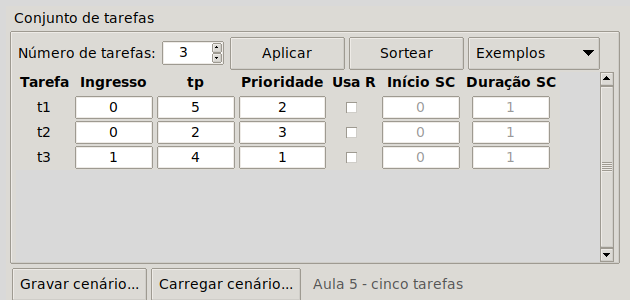

Os campos aceitam apenas números inteiros: ingresso maior ou igual a zero, `tp` maior que zero e prioridade maior ou igual a zero. Um valor fora dessas faixas é recusado no momento em que se clica em **Simular**: a janela da figura 2 aparece dizendo qual campo está errado, e o cursor volta para ele com o texto selecionado. Corrija o valor e clique em **Simular** de novo. O programa não fecha nem aceita o valor.

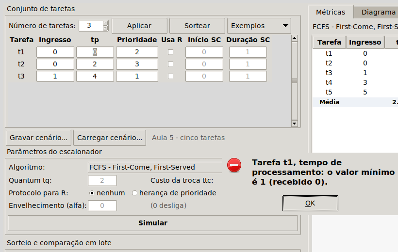

Para reduzir o número de tarefas, informe o novo valor em **Número de tarefas** e clique em **Aplicar**: as últimas linhas são removidas e as demais mantêm o que foi digitado. O máximo são 30 tarefas.

## 2. Sortear tarefas

Em vez de digitar, o simulador pode sortear o conjunto inteiro.

1. Informe em **Número de tarefas** quantas tarefas quer, por exemplo `5`.
2. No quadro **Sorteio e comparação em lote**, confira as faixas: **Ingresso máximo**, **tp máximo** e **Prioridade máxima**. Os valores iniciais (8, 6 e 5) são os do enunciado.
3. Clique em **Sortear**.

A tabela é preenchida com valores aleatórios dentro das faixas e o rótulo ao lado dos botões de gravar e carregar passa a dizer *cenário sorteado* (figura 3). Cada clique em **Sortear** produz um conjunto diferente.

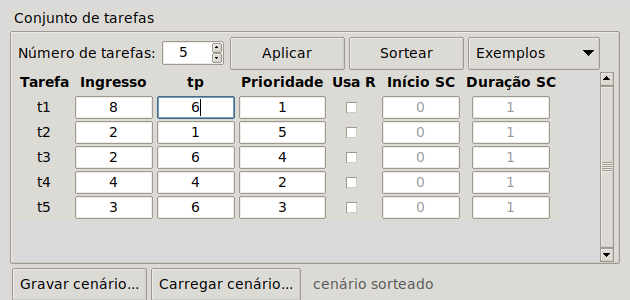

Marque **sortear seções críticas em parte das tarefas** para que o sorteio também atribua uso do recurso R a algumas tarefas.

O botão **Exemplos** abre a lista dos cenários de referência do enunciado (figura 4). Escolher um deles preenche a tabela e os parâmetros de uma vez. Os mesmos cenários estão gravados na pasta `cenarios/` do repositório.

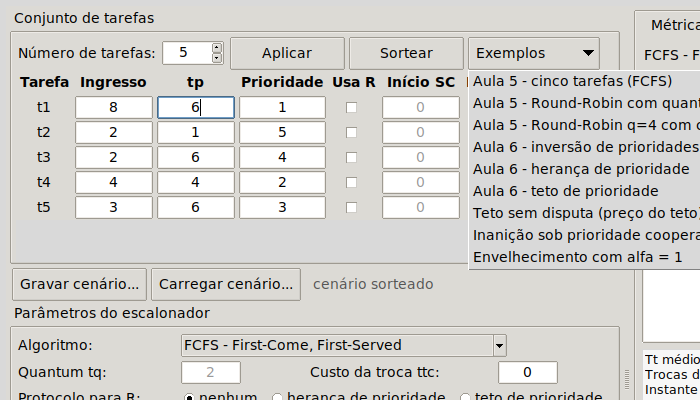

## 3. Definir os parâmetros de tempo

Os dois parâmetros de tempo ficam no quadro **Parâmetros do escalonador**:

- **Quantum tq** é a fatia de tempo do Round-Robin. O campo só fica habilitado quando o algoritmo escolhido é o RR.
- **Custo da troca ttc** é o tempo gasto em cada troca de contexto. Vale para todos os algoritmos e pode ser zero.

Para ver os dois em ação, clique em **Exemplos** e escolha **Aula 5 - Round-Robin q=4 com custo de troca 1**. O algoritmo passa a **RR - Round-Robin**, com **Quantum tq** igual a 4 e **Custo da troca ttc** igual a 1 (figura 5). Clique em **Simular**.

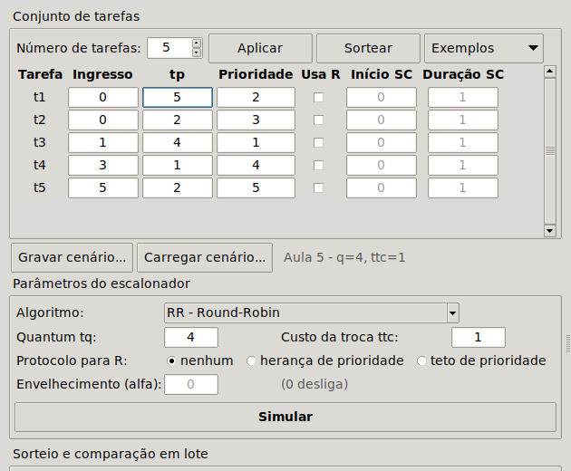

A aba **Métricas** mostra `Tt médio = 13,40` e `Tw médio = 10,60`, e o resumo abaixo da tabela informa a eficiência `E = tq/(tq+ttc) = 0,800` (figura 6). Nos outros cinco algoritmos, que não têm quantum, o mesmo campo diz *não definida (sem quantum)*.

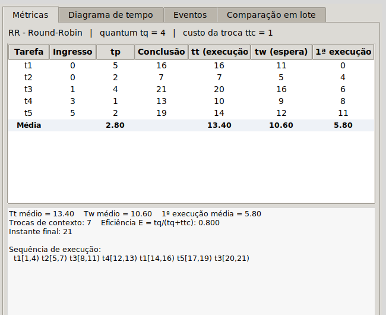

Na aba **Diagrama de tempo**, cada fatia começa por um trecho cinza, que é a troca de contexto, seguido do trecho colorido de execução útil (figura 7). A troca é descontada da fatia: com quantum 4 e custo 1, cada fatia entrega 3 unidades de trabalho.

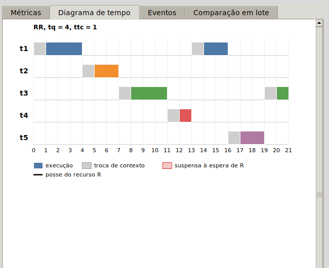

**O que acontece com um quantum menor ou igual ao custo.** Altere **Quantum tq** para `1`, mantendo o custo em 1, e clique em **Simular**. A combinação é recusada com a mensagem da figura 8, porque a troca consumiria a fatia inteira e nenhum trabalho útil seria feito. Corrija o quantum para `4` antes de continuar.

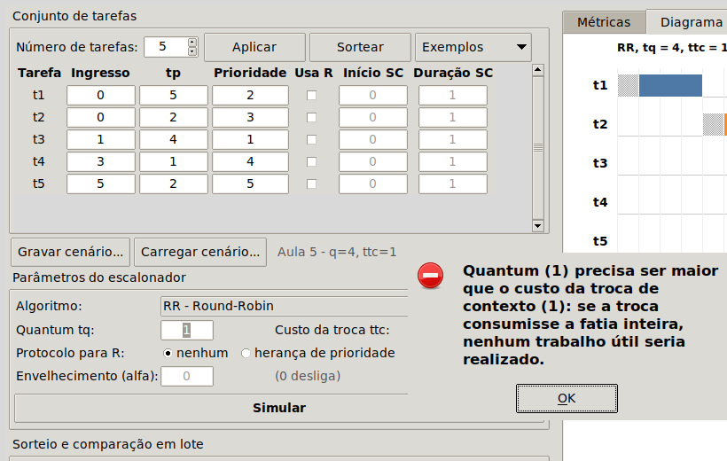

## 4. Escolher o algoritmo

O campo **Algoritmo** lista os seis algoritmos, sempre pela sigla seguida do nome:

| Sigla | Algoritmo | Preempção |
|---|---|---|
| FCFS | First-Come, First-Served | não |
| SJF | Shortest Job First | não |
| SRTF | Shortest Remaining Time First | sim |
| RR | Round-Robin | por quantum |
| PRIOc | Prioridade cooperativa | não |
| PRIOp | Prioridade preemptiva | sim |

Ao trocar o algoritmo, os campos que não se aplicam ficam desabilitados: **Quantum tq** só vale para o RR, e **Envelhecimento (alfa)** só para PRIOc e PRIOp.

Os mecanismos de prioridade são ligados no mesmo quadro:

- **Protocolo para R**: **nenhum**, **herança de prioridade** ou **teto de prioridade**. Só têm efeito quando alguma tarefa usa o recurso R.
- **Envelhecimento (alfa)**: passo pelo qual a prioridade de uma tarefa pronta cresce a cada unidade de tempo sem ser despachada. Zero desliga o mecanismo.

Para comparar os algoritmos sobre o mesmo conjunto, basta trocar o algoritmo e clicar em **Simular** de novo: a tabela de tarefas não muda.

## 5. Declarar o uso do recurso

Uma tarefa disputa o recurso R quando a coluna **Usa R** da sua linha está marcada. Ao marcar, os dois campos seguintes ficam habilitados:

- **Início SC**: quantas unidades de tempo a tarefa executa antes de pedir R;
- **Duração SC**: por quantas unidades de execução própria ela mantém R.

Início 1 e duração 4 significam que a tarefa obtém R depois de executar 1 unidade e o libera ao completar 5 unidades executadas. A seção crítica precisa caber dentro de `tp`; caso contrário o valor é recusado ao simular.

Para ver a inversão de prioridades, clique em **Exemplos** e escolha **Aula 6 - inversão de prioridades**. A tabela fica como na figura 9: `t1` e `t4` usam R, e o algoritmo é o PRIOp sem protocolo.

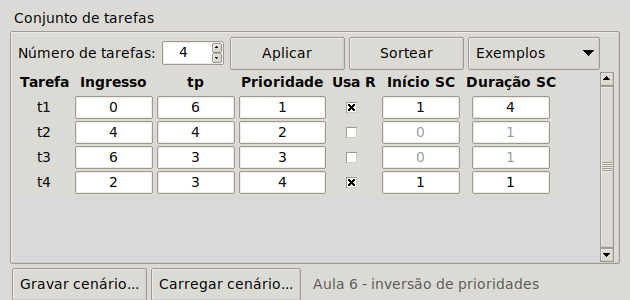

Clique em **Simular**.

## 6. Ler os resultados

### 6.1 Tabela de métricas

A aba **Métricas** (figura 10) traz uma linha por tarefa com:

| Coluna | Significado |
|---|---|
| **Ingresso**, **tp** | os dados de entrada |
| **Conclusão** | instante em que a tarefa terminou |
| **tt (execução)** | tempo de execução: conclusão menos ingresso |
| **tw (espera)** | tempo de espera: `tt − tp`; inclui fila, suspensão à espera de R e trocas de contexto |
| **1ª execução** | tempo entre o ingresso e o primeiro despacho |

A última linha, **Média**, traz as médias de `tp`, `tt`, `tw` e da primeira execução. Abaixo da tabela, o resumo informa o número de trocas de contexto, a eficiência, o instante final e a **sequência de execução** no mesmo formato usado em aula, `t1[0,2) t4[2,3) ...`.

Quando alguma tarefa esperou por R, o resumo acrescenta o bloco **Espera pelo recurso R**, que separa, para cada tarefa suspensa, quantas unidades ela esperou pela detentora do recurso (bloqueio direto) e quantas esperou por terceiras que nem usam R (inversão de prioridades). No cenário da Aula 6, `t4` tem 3 unidades de bloqueio direto e 7 de inversão.

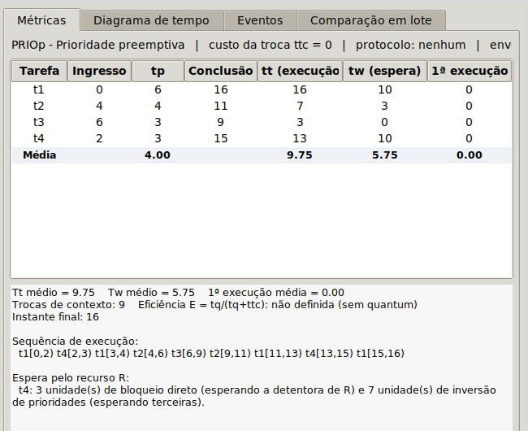

### 6.2 Diagrama de tempo

A aba **Diagrama de tempo** (figura 11) desenha uma linha por tarefa, com o tempo no eixo horizontal:

- **barra colorida**: a tarefa está executando;
- **barra cinza**: a tarefa está sendo carregada, isto é, a troca de contexto está sendo cobrada;
- **faixa vermelha hachurada**: a tarefa está suspensa à espera de R;
- **traço preto acima da linha, com a letra R**: intervalo em que a tarefa mantém o recurso.

O título do diagrama repete o algoritmo e os parâmetros usados. A legenda fica abaixo do eixo. Se o diagrama for mais largo que a aba, use a barra de rolagem horizontal.

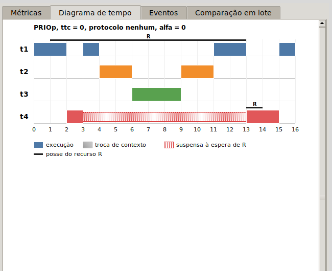

### 6.3 Eventos

A aba **Eventos** (figura 12) lista, instante a instante, o que o motor fez: obtenção e liberação de R, suspensões, preempções, heranças de prioridade, conclusões e períodos ociosos. É a forma mais direta de entender por que uma tarefa esperou.

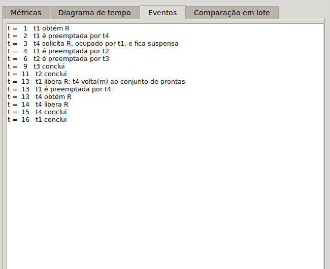

### 6.4 Herança e teto

Ainda com o cenário da Aula 6 carregado, marque **herança de prioridade** em **Protocolo para R** (figura 13) e clique em **Simular**. O diagrama (figura 14) mostra `t1` executando de 3 a 6 sem ser interrompida por `t2`: ao ficar suspensa, `t4` emprestou sua prioridade a `t1`. A conclusão de `t4` cai de 15 para 8 e o `Tw médio` de 5,75 para 5,50.

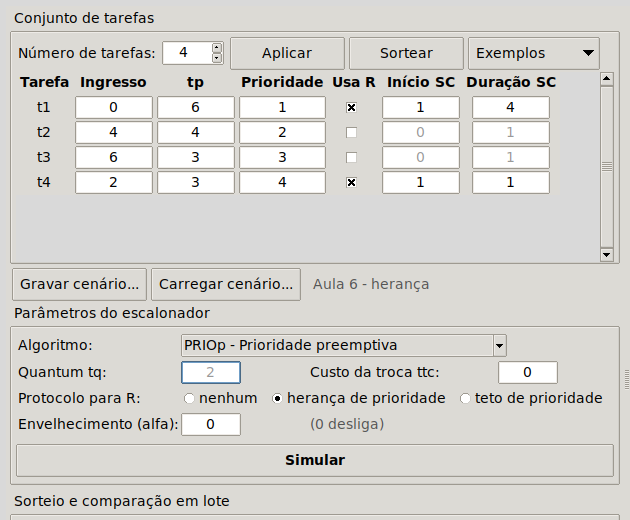

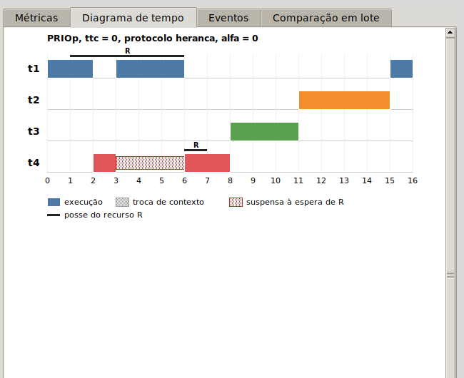

Marque **teto de prioridade** e clique em **Simular** de novo. As médias são as mesmas da herança, mas o caminho é outro (figura 15): `t1` recebe o teto 4 no instante em que obtém R, no instante 1, e por isso `t4` nem chega a ser despachada antes de R ser liberado. Não há faixa vermelha: o bloqueio foi prevenido, não encurtado.

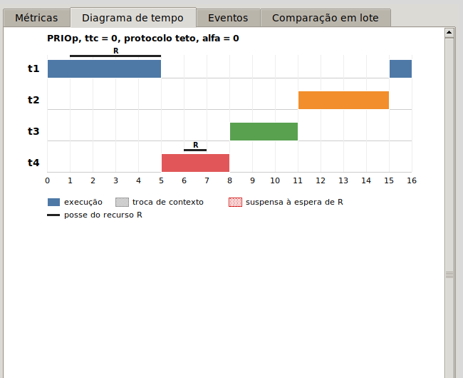

### 6.5 Envelhecimento

Escolha em **Exemplos** o cenário **Inanição sob prioridade cooperativa** e clique em **Simular**. Sob PRIOc, `t1`, de prioridade 1, só executa depois de todas as tarefas de prioridade 5 (figura 16): `tw` de `t1` vale 10.

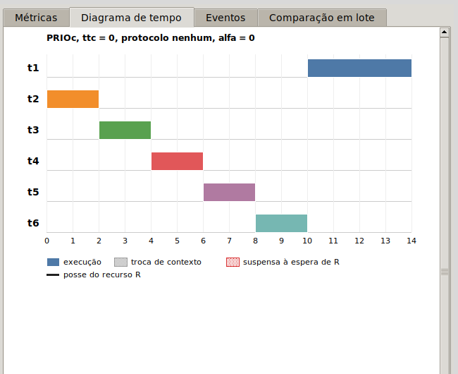

Informe `1` em **Envelhecimento (alfa)** (figura 17) e clique em **Simular**. A prioridade efetiva de `t1` cresce uma unidade por instante de espera, alcança 5 no instante 4 e ela passa à frente (figura 18): `tw` de `t1` cai para 4. Com alfa igual a 2 o cruzamento ocorre no instante 2 e `tw` de `t1` cai para 2, ao custo de um `Tw médio` maior para o conjunto.

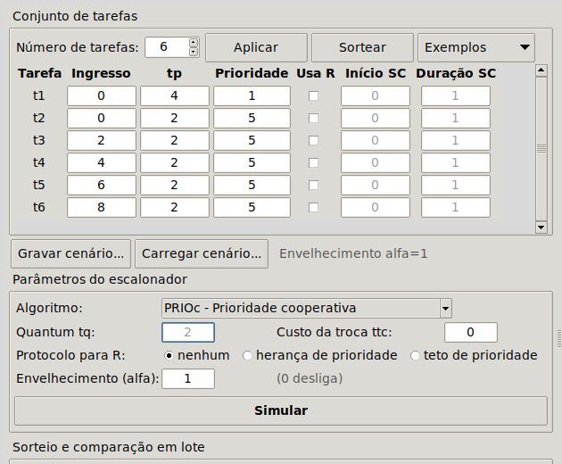

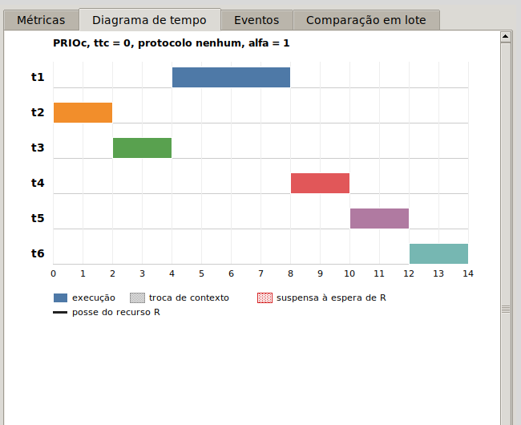

### 6.6 Comparação em lote

O botão **Comparar os seis algoritmos em lote** sorteia o número de cenários indicado em **Cenários no lote**, cada um com o **Número de tarefas** e as faixas do quadro de sorteio, simula todos sob os seis algoritmos com o quantum e o custo de troca informados nos parâmetros, e mostra na aba **Comparação em lote** as médias de `tt`, `tw` e primeira execução (figura 19). Abaixo da tabela, o programa aponta qual algoritmo obteve o menor `Tw` e qual obteve a menor primeira execução.

Com os valores iniciais (5 tarefas, ingresso até 8, `tp` até 6, prioridade até 5, quantum 2, custo 0 e 50 cenários), o SRTF fica com o menor `Tw` e o Round-Robin com a menor primeira execução. Os números mudam a cada clique, porque os cenários são sorteados de novo; a ordenação se mantém.

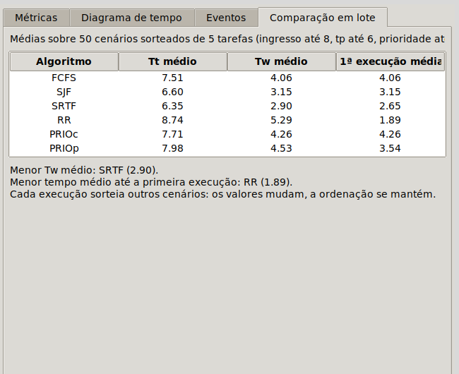

## 7. Gravar e recarregar um cenário

Qualquer conjunto de tarefas, digitado ou sorteado, pode ser preservado com os parâmetros em uso.

1. Clique em **Gravar cenário...**. Abre-se a janela de salvar arquivo, já na pasta `cenarios/` (figura 20).
2. Digite um nome, por exemplo `meu_cenario`, e clique em **Save** (ou **Salvar**). O arquivo `meu_cenario.json` é criado e uma mensagem confirma o caminho.
3. Feche o programa e abra-o de novo.
4. Clique em **Carregar cenário...**, escolha `meu_cenario.json` e clique em **Open** (ou **Abrir**). A tabela, o algoritmo, o quantum, o custo de troca, o protocolo e o envelhecimento voltam exatamente como estavam, e o nome do arquivo aparece ao lado dos botões.

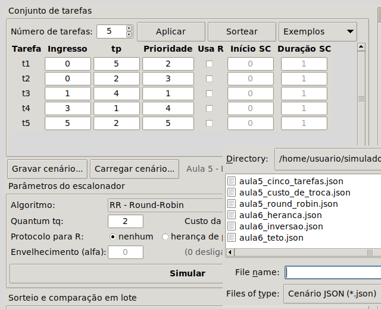

O arquivo é um JSON legível, que pode ser editado à mão:

```json
{
  "nome": "meu_cenario",
  "parametros": {"algoritmo": "PRIOp", "quantum": 2, "custo_troca": 0,
                 "protocolo": "heranca", "envelhecimento": 0},
  "tarefas": [
    {"id": 1, "ingresso": 0, "tp": 6, "prioridade": 1, "uso_de_r": [1, 4]},
    {"id": 2, "ingresso": 4, "tp": 4, "prioridade": 2}
  ]
}
```

Um arquivo que não esteja nesse formato, ou que descreva valores fora das faixas válidas, é recusado com uma mensagem que diz o motivo.

## 8. Conferir um resultado conhecido

Para confirmar que o simulador está correto na sua máquina, reproduza o cenário da Aula 5 sob cada um dos seis algoritmos.

1. Clique em **Exemplos** e escolha **Aula 5 - cinco tarefas (FCFS)**. A tabela recebe as tarefas da tabela 2.
2. Com **Custo da troca ttc** igual a 0, clique em **Simular** e anote `Tt médio`, `Tw médio`, `1ª execução média` e o número de trocas.
3. Troque o **Algoritmo** e repita. Para o RR, use **Quantum tq** igual a 2.

Tabela 2 — cenário da Aula 5.

| Tarefa | Ingresso | tp | Prioridade |
|---|---|---|---|
| t1 | 0 | 5 | 2 |
| t2 | 0 | 2 | 3 |
| t3 | 1 | 4 | 1 |
| t4 | 3 | 1 | 4 |
| t5 | 5 | 2 | 5 |

Os valores que o simulador deve exibir são os da tabela 3.

Tabela 3 — resultados esperados.

| Algoritmo | Tt médio | Tw médio | 1ª execução média | Trocas |
|---|---|---|---|---|
| FCFS | 8,00 | 5,20 | 5,20 | 5 |
| RR (tq = 2) | 8,40 | 5,60 | 2,80 | 8 |
| SJF | 5,80 | 3,00 | 3,00 | 5 |
| SRTF | 5,40 | 2,60 | 2,40 | 6 |
| PRIOc | 6,60 | 3,80 | 3,80 | 5 |
| PRIOp | 5,60 | 2,80 | 2,20 | 7 |

Em seguida, com **Custo da troca ttc** igual a 1: o FCFS deve dar `Tt = 11,00` e `Tw = 8,20`, com eficiência não definida; o RR com **Quantum tq** igual a 4 deve dar `Tt = 13,40`, `Tw = 10,60` e `E = 0,800`.

Por fim, o cenário **Aula 6 - inversão de prioridades** deve dar `Tt = 9,75` e `Tw = 5,75`, com conclusões 16, 11, 9 e 15 para `t1` a `t4`; com **herança de prioridade** ou **teto de prioridade**, `Tt = 9,50` e `Tw = 5,50`, com conclusões 16, 15, 11 e 8.

Se todos esses números conferem, o simulador reproduz as convenções do enunciado.
